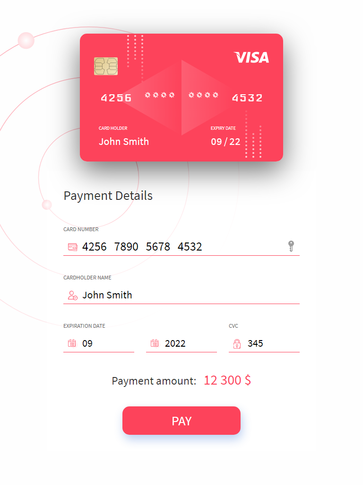

# React - PayApp

> This project was bootstrapped with [Create React App](https://github.com/facebook/create-react-app).
>
> Inspired by [vue-interactive-paycard](https://github.com/muhammed/vue-interactive-paycard).
>
> UI designed by [Arina](https://dribbble.com/Belikova) from [dribbble](https://dribbble.com/).

<b>A payment application with smooth and sweet micro-interactions.</b>

## Features

- **Modularity**: Project has been separated into independent, interchangeable modules, such that each contains everything is necessary to execute only one aspect of the desired functionality.

- **Responsive Layout**: CSS media queries, flexible boxes and scaled font-sizes have been used, so that the layout best fits users' available screen sizes.

- **Representational Card View**: Card is represented by a component with smooth and sweet micro-interactions.

- **Card Brand Identification**: Card network is detected by comparing card number input with the IIN ranges, and the brand logo is displayed on the representational view of the card in real-time. In addition, this information is used in formatting and validation of inputs.
  
  > *American Express*, *Discover*, *Maestro*, *MasterCard* and *Visa* are currently available networks.
  
- **Input Formatting**: The data obtained from the inputs are processed in real-time and formatted properly. (DOM manipulation is handled by *React*.)

- **Mobile-Friendly Inputs**: Suitable mobile keyboards are shown to make users' interaction with form inputs easier.

##### TODO:

- **Input Validation**

- **Customizable Styles**

## Available Scripts

In the project directory, you can run:

### `npm start`

Runs the app in the development mode.\
Open [http://localhost:3000](http://localhost:3000) to view it in the browser.

The page will reload if you make edits.\
You will also see any lint errors in the console.

### `npm test`

Launches the test runner in the interactive watch mode.\
See the section about [running tests](https://create-react-app.dev/docs/running-tests/) for more information.

### `npm run build`

Builds the app for production to the `build` folder.\
It correctly bundles React in production mode and optimizes the build for the best performance.

The build is minified and the filenames include the hashes.\
Your app is ready to be deployed!

See the section about [deployment](https://create-react-app.dev/docs/deployment/) for more information.

### `npm run eject`

**Note: this is a one-way operation. Once you `eject`, you can’t go back!**

If you aren’t satisfied with the build tool and configuration choices, you can `eject` at any time. This command will remove the single build dependency from your project.

Instead, it will copy all the configuration files and the transitive dependencies (webpack, Babel, ESLint, etc.) right into your project so you have full control over them. All of the commands except `eject` will still work, but they will point to the copied scripts so you can tweak them. At this point you’re on your own.

You don’t have to ever use `eject`. The curated feature set is suitable for small and middle deployments, and you shouldn’t feel obligated to use this feature. However we understand that this tool wouldn’t be useful if you couldn’t customize it when you are ready for it.

## Learn More

You can learn more in the [Create React App documentation](https://create-react-app.dev/docs/getting-started/).

To learn React, check out the [React documentation](https://reactjs.org/).

## License

This project is open source and available under the MIT License.